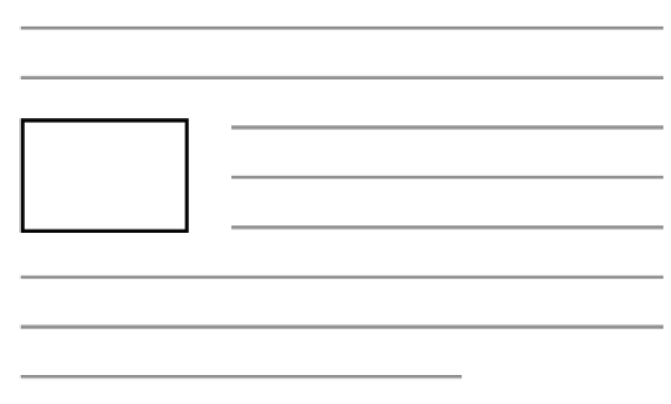
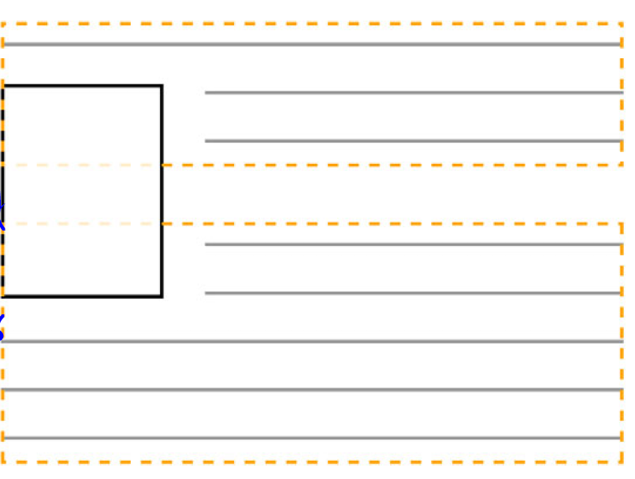

# Methods to alter document flow:

1. floats
2. flexbox
3. grids

# floats:



- Floats pulls an element to one side of container allowing document flow to wrap around it. Most commonly this kind of layout was found in newspaper and in order to support such layout, floats were added to CSS
- Floated element is removed from the normal document flow and pulled to the edge of container. The document flow then resumes but it will be wrapped around the floated element.
- However, floats has been used very commonly for document layout even though that was not the original intent.
- Floated element do not add to the height of their parent elements. The implication of this is that if the floated images are taller then the wrapping paragraphs, the next image will begin immediately below the text of the first paragraph. Both the text will wrap the floated image. Below is an example:



# clear fix:

- One way to fix the height issue is by adding an empty block element at the end of layout and apply `clear: both` to this element. Now the container will expand to contain this block element resulting in float element being contained within the height of the container. This is rather hacky because you need to add element to fix layout, css problem.
  eg:

```css
.floated {
  float: left;
}
```

```html
<main>
  <div class="floated">sometihng with flaots</div>
  <div class="floated">sometihng with flaots</div>
  <div class="floated">sometihng with flaots</div>

  <div style="clear: both"></div>
</main>
```

- A more better fix is to use the css pseudo-element `::after`

```css
.clearfix::after {
  display: table;
  content: " ";   <==== works even with empty string ("")
  clear: both;
}
.floated {
  float: left;
}
```

```html
<main class="clearfix">
  <div class="floated">sometihng with flaots</div>
  <div class="floated">sometihng with flaots</div>
  <div class="floated">sometihng with flaots</div>
</main>
```

With this approach, you do not have to add new HTML just for the sake of containing height. CSS is actually used to solve styling problem

> **common mistake:** clearfix should be applied to the container that contains float. It is common mistake to appy it to the worng element such as the float itself or the container after the one that contains the floats.

For clearfix, you could have used of `display: block` but sometime you can likely have margins not collapsing properly. To fix that use display of type table. This way you will contain the margin of the child elements.

> Tip: can use use `::before` too fix margin related issue (but clear is for after pseudo element)
