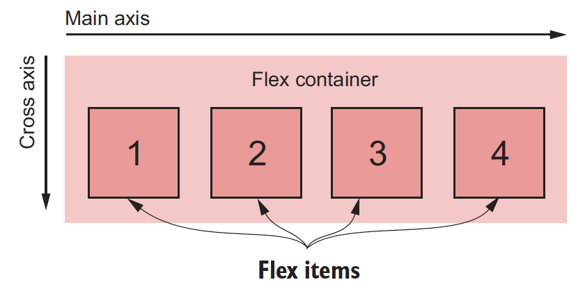
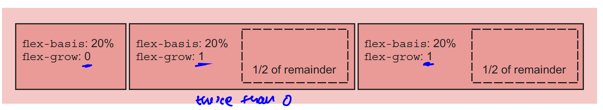
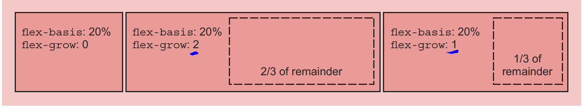
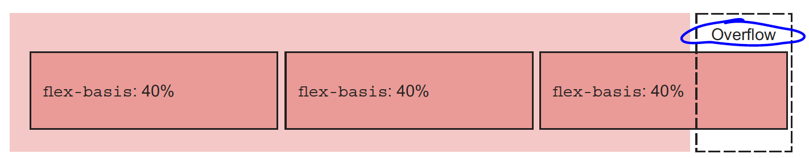
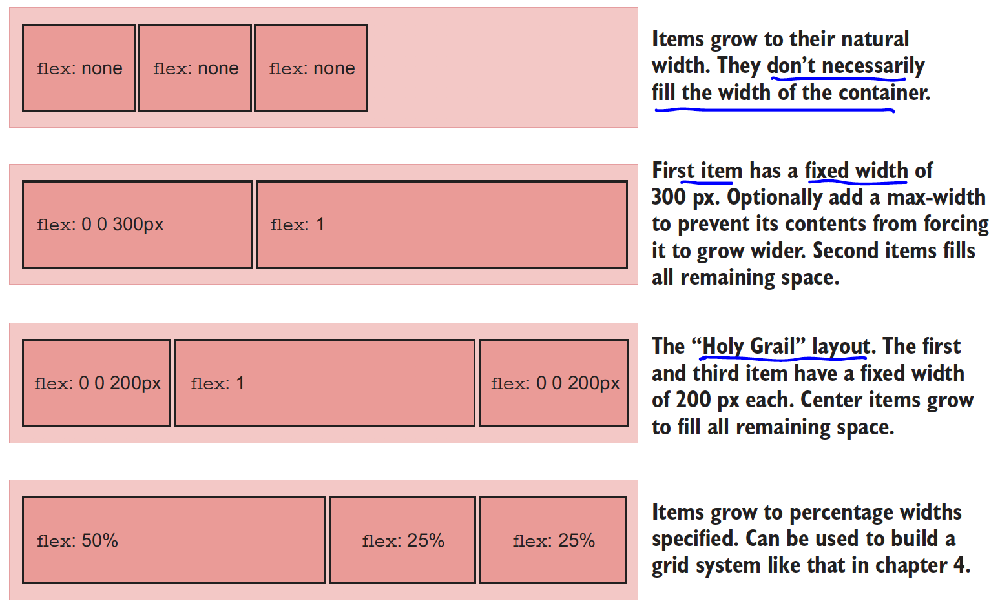

# Flexible box layout => Flexbox

> Simple solution to the long standing CSS problem vertical centering and equal height columns.

```css
display: flex | inline-flex;
```

### Starting

- To a container apply `display: flex` and the container is now `flex container` and its direct children (the items it contains are) `flex items`.
- Flex container fills all available width.
- Inside a flex container, items align side by side, left to right, all in one row. These items do not necessarily fill all available width of the container.

> **inline-flex** container will not fill all available width but the items behave just like flex items

> using `display: flex` really gets you far before you even have to worry about other properties of flex box.

### Axis



#### Main axis:

- Inside the flex container, items are placed along a line called the main axis, which goes from `main-start` (left) to `main-end` (right).

#### Cross axis:

- The axis perpendicular to the Main axis is the cross axis. It goes from `cross-start` (top) to `cross-end` (bottom).

> The direction of these axis can be changed

### Spacing between flex items:

#### Different spacing between items: margin

- good 'ol margin!
- to apply different margin between items, make use of margin-left/right. If you set the value to `auto`, items will fill the available spaces.

#### Equal spacing between items: justify-content

> Refer to MDN document for complete list of values

### Flex Item sizes: flex

> applied to flex item

> Old ways to define size of item was width & height properties. However, flexbox offers more.

- Default items will be sized based on their content. This is nothing new. To control individual flex item make use of `flex` property (applied to flex items not the container)

eg:

```css
.myFlexItem {
  flex: 2;
}
```

- flex is shorthand for the three different sizing property `flex-grow`, `flex-shrink`, `flex-basis`. When you specify flex with only one value it is eqiuvalent to `your-value 1 0%`. So `flex: 2` means `flex: 2 1 0%`;

#### flex-basis:

- means initial main size of an element before the remaining space is distributed.
- values can be specified in px, em or percentages.
- by default browser set's flex-basis to auto which means looks at the item's width property; however, if width is not declared use the content to determine the size.
- width will be ignored for any elements that has flex basis other then auto.

- once flex basis is computed for each flex item, they (plus margins between them) will add up to some width. This width may or may not fill the flex container. Therefore, the items need to grow or shrink in order to fill (fit) the flex container along the main axis.

#### flex-grow:



- this is when the width of items do not fill the container leaving room to grow for items. The value of the flex-grow, a non negative integer, defines how an item can consume part of remainder space.
- in above diagram, the container has 3 items. The inital width for each item is 20%. After that is consumed, there is remaining space. This is where flex-grow comes in. For first items, flex grow is 0 but the for 2nd and 3rd items is 1 & 1. Thefore, the last two items will consume equal amount from remaining space. Hence, they look wider then the first element.

Here is another example:



- First element will consume 20% of height and stay that way. For second item, it will consume 2/3rd of remaining space; 3rd item will consume 1/3rd of remaining space.

- when we set `flex: 2`, it sets the basis to 0% meaning, 100% of container width is remainder. The remainder, aka 100%, of width is up for distribution based on flex-grow, the value 2

#### flex-shrink:



- this is when the width of the items exceeds the container width, thus resulting in overflow.

- in the above diagram container has 3 items. Width of 3 items combined makes 120% and therefore results in overflow. This is where flex-shrink comes in. Flex-shrink value of each flex items describe how items wil shrink. A value of 0 means do not shrink; any other value greater than 0 means, those item will shrink. Item with higher shrink value will shrink more than an item with lower value.

> Tip: favor use of shorthand flex property

### Possible layout you can make using flex:



### Flex Direction

- possible values `flex-direction: row | column | row-reverse | column-reverse`
- default value is row: `flex-direction: row` which is why items flow from left to right.

- you can shift direction of items in flexboxes.
